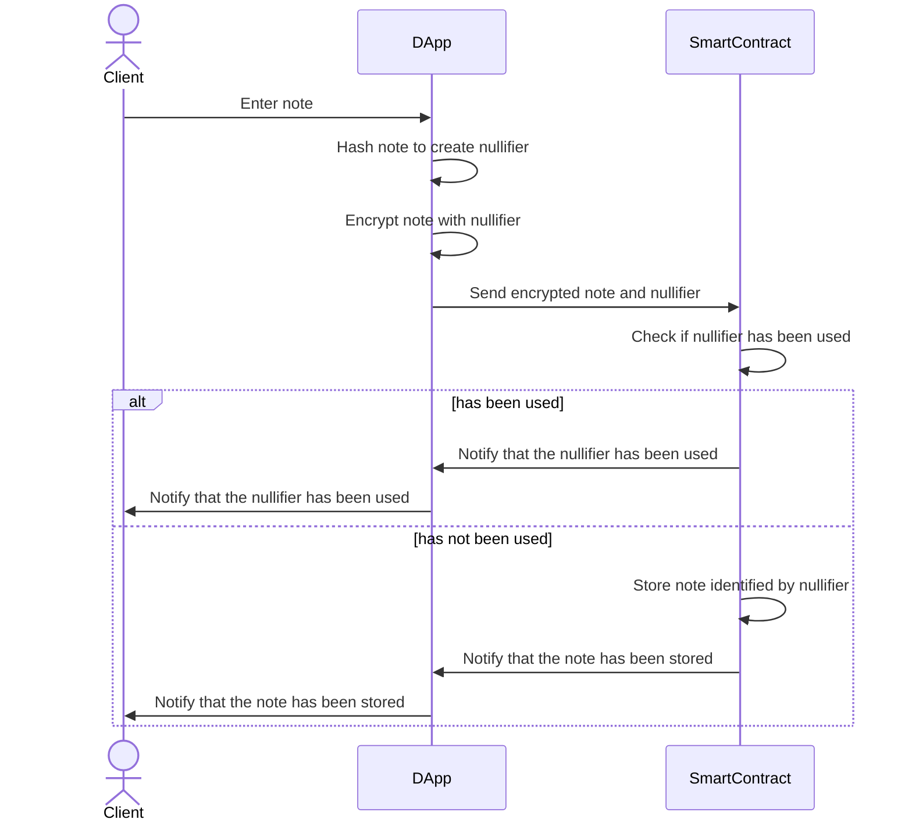
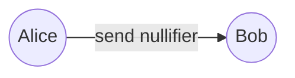
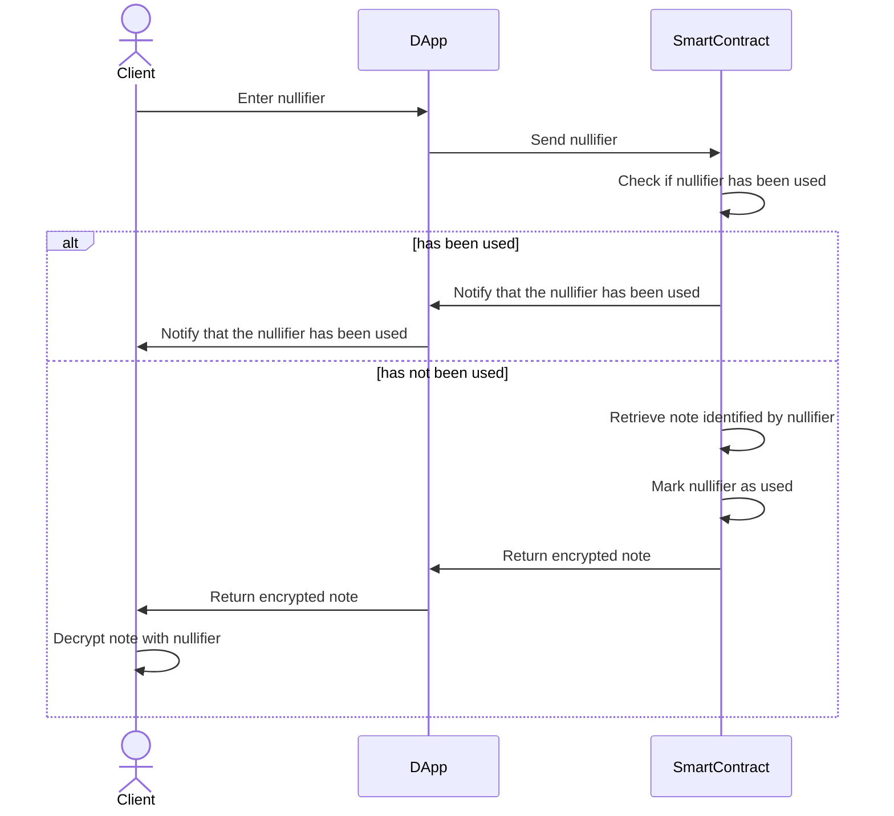

# Avoiding Double Spending with Nullifiers - research project

The goal of this small research project was to "*Implement a nullifier for a DApp where the double spending problem would arise otherwise.*"

To do so we implemented a small MVP for a "One-time note sharing" DApp. This problem can be solved with the help of blockchains or traditional with a centralized server approach. Both approaches will be compared and evaluated against each other.

### What is a nullifier?
"A cryptographic nullifier is a unique identifier generated by cryptographic algorithms to represent in an anonymous and privacy preserving manner the spending of a specific asset"

The nullifier is used to "prevent a user from doing an action twice while keeping them anonymous."[[1]](#1)

The simplest nullifier generation is a hash of a specific asset such as:
```bash
hash(text)
```
where the hash could be SHA and the text a String or something else. What we initially used is a simple has of the note and the current unix time. This is okay and naive but has some security implications later on.
```javascript
const hash = web3.utils.sha3(note + Date.now());
```
0x5baf10211f6fb43b79d1827c1d5edda50589b4862ac394d3fd9b48dfd6e64c8c
## DApp architecture
**Step 1:**
Alice creates a Note in the DApp, the note is encrypted with the nullifier. Both the encrypted note and the nullifier are than committed to the smart contract.



The respective function in the smart contract is:
```solidity
function storeNote(bytes32 nullifier, bytes memory encryptedNote) public {
    require(!usedNullifiers[nullifier], "Nullifier already used");
    notes[nullifier] = encryptedNote;
    emit NoteStored(nullifier);
}
```
The encrypted note is saved in a mapping, identified by the nullifier. Crucial for preventing double spending or redeeming the note twice is the check if the nullifier was marked as used. The chance of a nullifier collision e.g. a collision in the hash function is almost zero.

**Step 2:**
Alice has to "somehow" communicate the nullifier to Bob

**Step3:**
Bob uses the nullifier to redeem the note an decrypt it.

Below is the function in the smart contract responsible for retrieving the note. Very important is the check if the nullifier has been used before. 

```solidity
function retrieveNote(bytes32 nullifier) public returns (bytes memory) {
    require(!usedNullifiers[nullifier], "Note already read");
    bytes memory note = notes[nullifier];
    require(note.length > 0, "Note does not exist");
    
    usedNullifiers[nullifier] = true;
    // potentially delete the note
    // delete notes[nullifier];
    emit NoteRetrieved(nullifier, note);
    return note;
}
```

### So all good? Not quite
The nullifier and the encrypted note are revealed to all users when the note is retrieved. Therefore is is very simple for everybody who knows the cipher to decrypt the note.

**Proof:**


In this block we find the committed nullifier: 

*0x02c323de21e228452893b47307c541aaf9e4b1e046d1e87a7a8dcae234ec8d32bd0fa741*

and we find the encrypted data:

*0x553246736447566b58312f4f50654b31356a2f41622b626e616b67566e58783770534646614550397131323732344a2f6e557137336e344c38386174632b3361*

we then use AES to decrypt the message. We then get the note. Therefore this method is not secure!

## Traditional architecture


## References
<a id="1">[1]</a> Remco Bloemen, Nullifiers, 2024, https://2π.com/22/nullifiers/